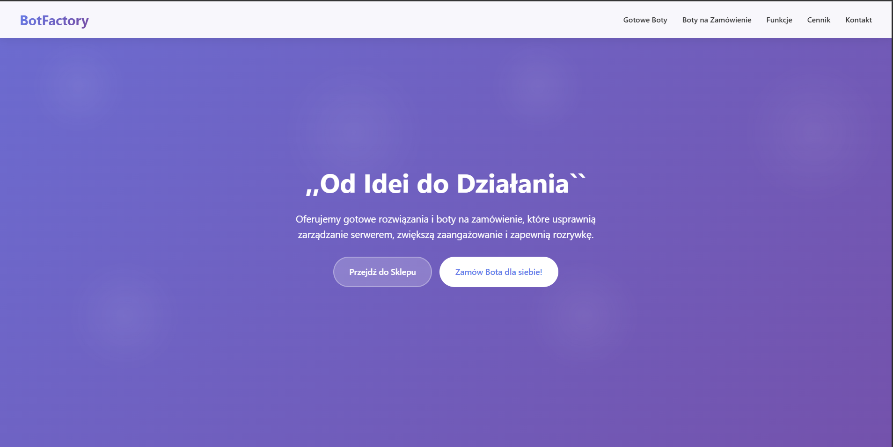
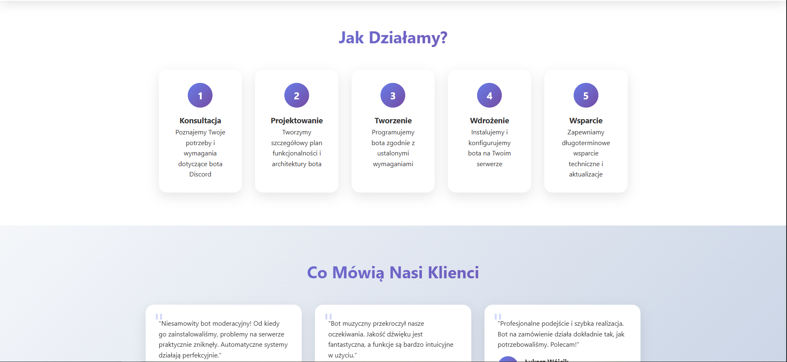
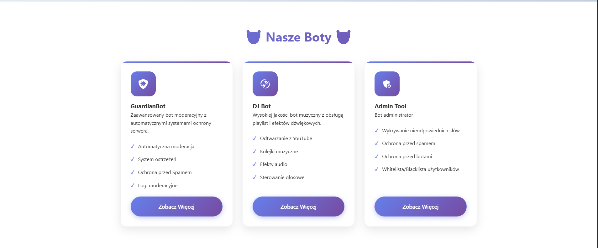
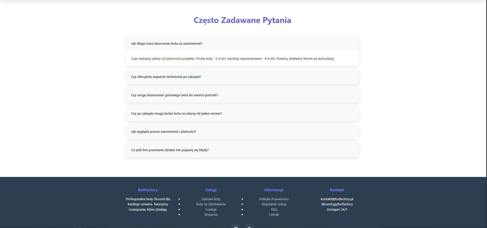

<h1 align="center" id="title">BotFactory</h1>

<p align="center">Projekt webowy stworzony przy użyciu <strong>React</strong> z <strong>Vite</strong> i czystego <strong>CSS</strong>. Stanowi bazę do tworzenia i zarządzania narzędziami lub ustawieniami dla botów Discorda. W początkowej fazie rozwoju, skupia się na solidnych fundamentach technologicznych.</p>

---

## 📸 Zrzuty ekranu projektu

<p align="center">
  
  &nbsp; &nbsp; &nbsp; &nbsp;
  
  &nbsp; &nbsp; &nbsp; &nbsp;
  
  &nbsp; &nbsp; &nbsp; &nbsp;
  
</p>

---

## 💻 Wykorzystane Technologie

* **React:** Biblioteka JavaScript do budowania interfejsów użytkownika.
* **Vite:** Nowoczesny bundler i serwer deweloperski, zapewniający szybki rozwój.
* **CSS:** Czysty CSS użyty do stylizacji komponentów, bez użycia preprocesorów czy frameworków CSS.

---

## 🚀 Jak uruchomić projekt lokalnie?

Aby uruchomić projekt `DiscordUtils` na swoim komputerze, wykonaj poniższe kroki.

### Wymagania

Upewnij się, że masz zainstalowane:
* **Node.js** (zalecana wersja LTS)
* **npm** (zazwyczaj instalowany razem z Node.js)

### Klonowanie Repozytorium

1.  **Sklonuj repozytorium:**
    Otwórz terminal i sklonuj projekt na swój komputer:
    ```bash
    git clone [https://github.com/funes781/BotFactory.git](https://github.com/funes781/BotFactory.git)
    ```

2.  **Przejdź do katalogu projektu:**
    ```bash
    cd DiscordUtils # lub nazwa folderu, do którego sklonowałeś projekt
    ```

### Instalacja zależności

1.  **Zainstaluj wszystkie wymagane moduły:**
    Przejdź do katalogu głównego projektu w terminalu i uruchom:
    ```bash
    npm install
    ```
    To polecenie zainstaluje wszystkie zależności wymienione w pliku `package.json`.

### Uruchomienie aplikacji

1.  **Uruchom projekt w trybie deweloperskim:**
    Po zainstalowaniu zależności, możesz uruchomić aplikację w trybie deweloperskim, który pozwala na podgląd zmian na bieżąco:
    ```bash
    npm run dev
    ```
    Aplikacja zostanie uruchomiona na adresie `http://localhost:5173` (domyślny port Vite) lub innym dostępnym porcie.

2.  **Zbudowanie projektu do wdrożenia (opcjonalnie):**
    Jeśli chcesz przygotować projekt do produkcyjnego wdrożenia, możesz zbudować jego zoptymalizowaną wersję:
    ```bash
    npm run build
    ```
    Spowoduje to utworzenie folderu `dist` z gotowymi plikami statycznymi.